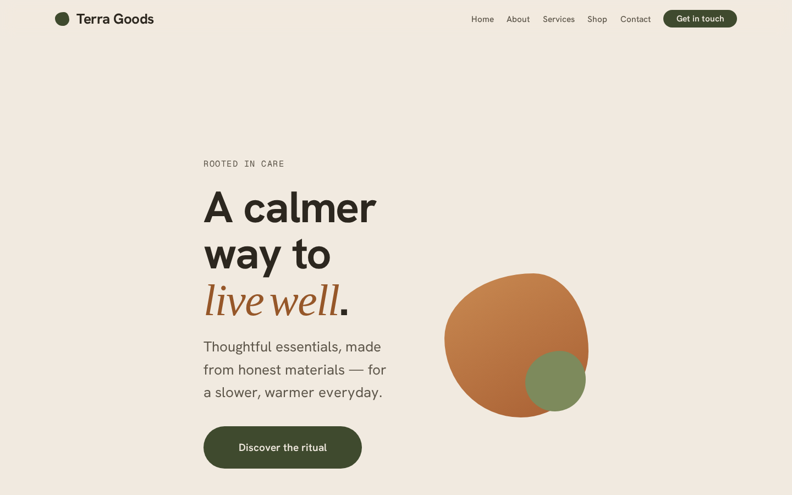
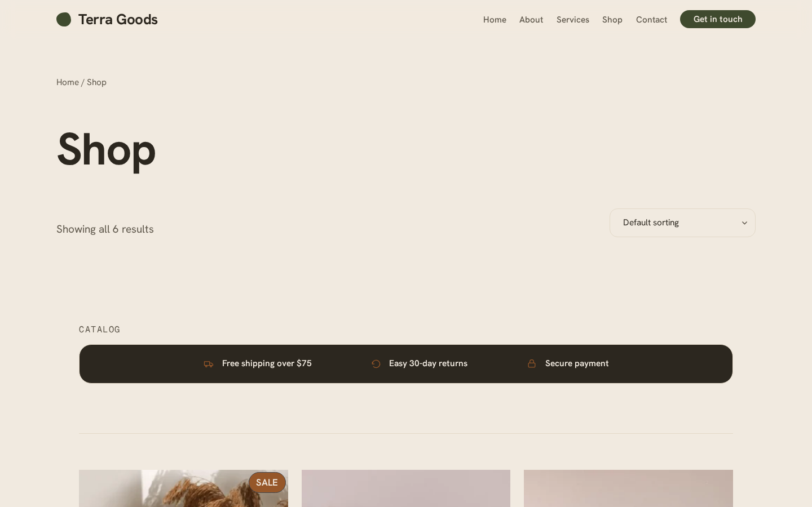
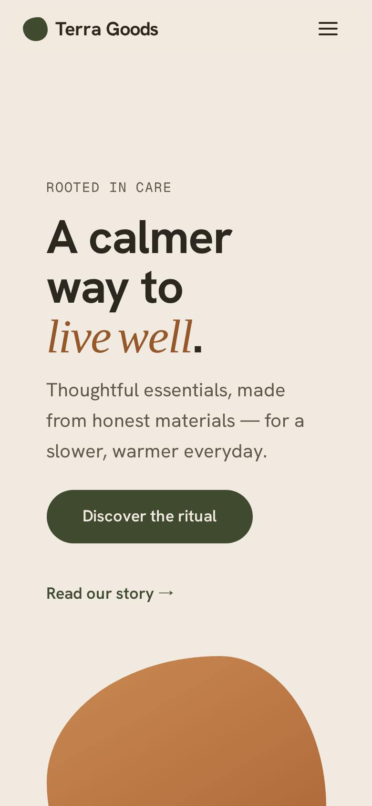
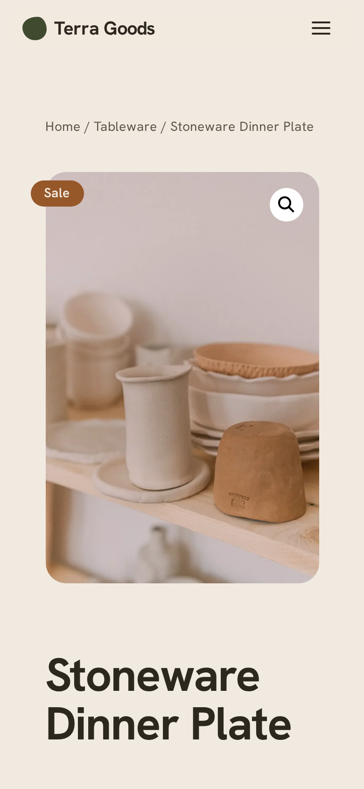

# Loamkit

**Grow production-shaped WordPress sites from a blank directory.** A
security-first WordPress / WooCommerce starter kit, shipped as a Claude Code plugin.

[](./LICENSE)
[](https://www.php.net/)
[](https://wordpress.org/)
[](https://code.claude.com/)

*Loam is fertile soil.* Loamkit is an **interactive install skill**: run one
command, answer a few questions, and it grows a project that fits — env config,
Composer dependencies, a tailored `CLAUDE.md`, restricted client roles, role-based
agents, fail-closed security hooks and MCP configuration. One codebase covers both
content **websites** and **WooCommerce e-shops**, and every project ships with a
real, art-directed design system (the default direction is **Terra** —
warm-organic) instead of stock WordPress.



<p align="center">
  
  
  
</p>

---

## 1. What it is

Loamkit turns a blank directory into a production-shaped WordPress project:

- **Code-first stack** — Bedrock (Composer-managed WordPress) + Roots Sage 11
  (Acorn 6, Blade, Vite), `theme.json` design tokens, optional DDEV.
- **Two branches, one kit** — a content **Website** branch and a **WooCommerce
  e-shop** branch, selected interactively. All per-choice config lives in bundled
  templates, not in the skill body.
- **Designed, not stock** — every project ships a premium, art-directed design
  system driven end-to-end, so you get custom-looking sites, not generic
  WordPress. See [Design system](#2-design-system) below.
- **Security-first / fail-closed** — the two-lane invariant and WooCommerce
  data-safety are enforced by hook scripts that parse the real command, MCP runs
  least-privilege, and quality gates (PHPCS, PHPStan, PHPUnit, Playwright) must be
  green before anything is "done".
- **Interactive & fail-closed setup** — choices are written to a validated
  `resolved-config.json`; a missing key or a risky combination stops the run
  before any files are written.
- **Opus 4.8 everywhere** — every shipped agent is pinned to `claude-opus-4-8`.

## 2. Design system

A premium, art-directed design system ships in every project and is enforced from
brief to build — the result is real, custom-looking sites, not stock WordPress.
See [`reference/design-system.md`](skills/wp-setup/reference/design-system.md) and
[`reference/eshop-design.md`](skills/wp-setup/reference/eshop-design.md).

- **Six bundled directions.** **Terra** is the default (warm-organic: sand /
  sage-olive / clay, Hanken Grotesk + a Fraunces-italic accent, soft warm depth).
  The others: **Atlas**, **Linen**, **Pulse**, **Monolith**, **Aurora**.
- **Token contract.** Each direction is a full `theme.json` contract: a 10-slug
  palette, fluid type scale, spacing rhythm, organic-blob + soft-shadow depth
  tokens, and self-hosted OFL fonts.
- **Pattern library.** A premium, token-driven block-pattern library with
  section-style colorways — patterns compose each page from the same tokens.
- **Bundled imagery.** **8 CC0 images**, warm-graded; client photos auto-grade
  on-brand via a `customDuotone` preset.
- **Motion.** Reduced-motion-safe **scroll-reveal**.
- **`frontend-design` skill.** Makes the kit **commit to one aesthetic** before any
  code — a two-pass method (pick a direction + one defensible risk, then
  self-critique against an AI-slop reject-list).
- **`wp-designer` art director.** A read-only agent that writes the brief (the
  `theme.json` token spec and which patterns compose each page) and acts as the
  visual critic in the design-review loop.
- **Design-review hard-fail gate.** A screenshot-driven Playwright loop iterates
  against a visual rubric **plus a hard-fail gate**: no centered-symmetric hero, no
  placeholders, real type weight-contrast, premium cards, a real subject above the
  fold, no hotlinked images.
- **E-shop storefront.** On the e-shop branch the same tokens drive a designed,
  conversion-aware WooCommerce storefront (styled product cards, Product-Collection
  store patterns, USP/trust touches). The **checkout stays stock and hard-locked —
  styled only**; the agent never enters the payment path.

## 3. Requirements

- **Claude Code** (recent version, with plugin + marketplace support).
- **PHP 8.4+** and **Composer** (Sage 11 / Acorn 6 require PHP >= 8.4.1).
- **Node.js** (for the theme build and Playwright E2E).
- **DDEV** (on a container engine) — the recommended local environment, and
  required in practice for the WooCommerce e-shop branch (HPOS behavior is
  engine-specific and needs MySQL/MariaDB).

> **DDEV is not an alternative to Docker — it runs *on top of* a container
> engine** (Docker Desktop, OrbStack, Colima, …) and orchestrates the WordPress
> stack for you (containers, DNS, local HTTPS, `ddev wp`, snapshots). For
> WordPress it's a clear step up from hand-wiring raw Docker / docker-compose.
>
> **Install (macOS):**
>
>     brew install ddev/ddev/ddev
>     mkcert -install      # one-time local HTTPS CA — asks for your password
>
> Container engine: **Docker Desktop** works out of the box; **OrbStack**
> (`brew install orbstack`) is a faster, lighter alternative many DDEV users
> prefer. Linux / Windows (WSL2): see <https://docs.ddev.com>.

The installer detects your local toolchain and warns about anything missing
before it scaffolds.

## 4. Install

Loamkit is distributed as a plugin through a GitHub marketplace:

```text
/plugin marketplace add jaymadeapp/Loamkit
/plugin install loamkit@loamkit
```

After installing, the install skill is available as `/loamkit:wp-setup`.

> **New here?** [`docs/getting-started.md`](docs/getting-started.md) is a verified
> end-to-end walkthrough: create → bring up → seed content → handle a request → deploy.

> Developing the kit itself? Prototype the installer as a project skill in
> `.claude/skills/wp-setup/` (SKILL.md hot-reloads). After changing
> `hooks/`, `.mcp.json` or `agents/`, run `/reload-plugins`. Validate with
> `claude plugin validate .` before publishing.

## 5. Run the installer

```text
/loamkit:wp-setup [project-slug]
```

The installer is **auto-invoked** when you ask to start a new WordPress project
("create a new WordPress eshop", "vytvoř nový web na WordPressu") and confirms the stack
and target directory before scaffolding; `/loamkit:wp-setup` is the explicit form.
It asks a short sequence of questions (via `AskUserQuestion`, in the main thread):

1. **Local env** — *Docker (DDEV)* (recommended, isolated, reproducible) or
   *No Docker* (native PHP + local DB; lighter, but e-shop and full CI parity are
   not guaranteed).
2. **Build type** — *Website* (Sage 11 + blocks) or *WooCommerce e-shop* (adds
   WooCommerce, HPOS, a payment human-gate and MySQL-only CI).
3. **Slug** — derive a kebab-case slug from the folder name, or type your own.
   If you passed a slug inline (`/loamkit:wp-setup my-shop`), this question
   is skipped.
4. **Subtype** — branched on build type:
   - Website → *Business*, *Blog*, or *Portfolio*.
   - E-shop → *Small shop* or *Catalog*.

The choices are written to a validated `resolved-config.json`, which is the
single contract shared by the config validator, the scaffolder and the
`CLAUDE.md` renderer. Validation is **fail-closed**: a missing key, a parse error
or a risky combination stops the run before any files are written.

## 6. What gets generated

A typical e-shop + Docker run produces something like:

```text
<project-slug>/
├── CLAUDE.md                      # tailored: stack, two-lane, quality gates, Woo data-safety
├── .claude/settings.json          # permissions + project hooks
├── .claude/deploy.json            # host-agnostic staging deploy config (branch/remote/url)
├── composer.json                  # Bedrock (+ WooCommerce/HPOS on the e-shop branch)
├── .env.example                   # Bedrock env template (never committed)
├── .gitignore                      # ignores .claude/requests/ (PII), *.sql and DB dumps
├── .mcp.json                      # Playwright + WordPress MCP (STDIO via WP-CLI, no app password)
├── .ddev/config.yaml              # Docker branch only (MySQL for e-shop)
├── config/                        # Bedrock config
├── web/
│   ├── app/mu-plugins/loamkit-roles.php   # restricted client roles + contentOnly
│   ├── app/mu-plugins/content-seed.php        # idempotent placeholder-content seeder (wp loamkit seed)
│   ├── app/mu-plugins/loamkit-design.php    # registers the Loamkit pattern category
│   ├── app/mu-plugins/loamkit-woo.php       # e-shop: WooCommerce theme support + HPOS + store hooks
│   └── app/themes/<slug>/         # Sage 11 + design system (theme.json tokens, patterns/, styles/, fonts/; + woo.css & store patterns on e-shop)
├── tests/                         # PHPUnit + (e-shop) Playwright checkout E2E
├── phpcs.xml                      # WPCS ruleset
├── phpstan.neon                   # PHPStan + szepeviktor/phpstan-wordpress
└── resolved-config.json           # resolved choices, schema-validated
```

Every generated file has a bundled template — nothing is generated "from
nothing". The website branch is the same, minus WooCommerce, the checkout E2E
spec and the `.ddev/` directory when you choose no-Docker.

## 7. How you work — the agent workflow

Loamkit ships role-based subagents (all Opus 4.8) that mirror a clean
delivery flow.

**Request intake (the front door).** When you relay a client request in plain language
("the client wants…", "zákazník chce…", in any language), the `intake` skill
**auto-triages** it and right-sizes the process: trivial asks skip the ceremony, pure
content is routed to the client editor / seeder, and checkout/payment requests force a
human gate. For non-trivial work it writes a spec to `.claude/requests/` (git-ignored —
may hold PII), optionally records a GitHub issue, and — once you approve — hands off to the
orchestrator. `/loamkit:intake "<request>"` is the explicit fallback.

The **orchestrator** routes work; a typical task fans out as:

```text
wp-orchestrator
   → wp-analyst     (investigate code/docs, report with file:line — read-only)
   → wp-architect   (design + trade-offs, respects two-lane/Woo — read-only)
   → frontend-design skill  (commit to ONE direction + risk before any code — two-pass)
   → wp-designer    (aesthetic brief + theme.json token spec + pattern plan — read-only)
   → wp-engineer    (implement across files — effort: high)
   → wp-security-reviewer + wp-tester  (run in parallel)
   → design-review loop  (screenshot 3 viewports → hard-fail gate + rubric → fix; visible-UI work)
```

- **wp-analyst** — investigates and reports evidence; verifies external facts via
  WebSearch / allow-listed WebFetch; never invents WP/Woo APIs.
- **wp-architect** — designs across affected files, lists trade-offs; read-only.
- **frontend-design** *(skill)* — runs before any visible build: a two-pass method
  that **commits to ONE of the six directions** (Terra default) + a token system + one
  defensible risk, then self-critiques against an AI-slop reject-list before a line of
  markup is written. The commitment is the brief the designer carries.
- **wp-designer** — the read-only art director: for visible-UI work it **commits to one
  aesthetic direction** and writes the brief — the `theme.json` token spec and which
  patterns compose each page — and is the visual critic in the design-review loop. Stops
  "stock WordPress".
- **wp-engineer** — implements the approved design following Bedrock/Sage
  conventions and the designer's token spec; the most consequential role, so it
  runs at `effort: high`.
- **wp-security-reviewer** — audits the diff (SQLi/XSS/CSRF/nonce/cap checks,
  secrets, two-lane violations, Woo payment/checkout changes); blocks on anything
  critical.
- **wp-tester** — runs PHPCS, PHPStan, PHPUnit and Playwright; reports pass/fail
  with evidence and verifies the MySQL engine for e-shops.

**Quality gates** that must pass before "done": PHPCS (WPCS) clean, PHPStan green,
PHPUnit green, Playwright E2E green, zero critical security findings on the diff,
and — for visible-UI work — the `design-review` loop PASSes (every rubric dimension
≥ 2, with objective contrast / overflow / font-fallback / console checks green).

## 8. Security model

Loamkit is fail-closed by design. The headline rules are enforced by **hook
scripts that parse the actual command**, not by permission globs (a glob like
`Bash(* db push*)` gives a false sense of safety and often fails to match).

> **Defense in depth, not a single magic wall.** The hooks below are heuristic
> guards — hardened against known bypasses (outbound `ssh`/`scp`/`rsync`/
> `mysqldump` exfiltration, bulk `git add -A` of secrets/dumps, …) and backed by a
> guard self-test suite — but no command-parsing heuristic is a perfect boundary.
> They are **one layer**, reinforced by the least-privilege MCP capability role,
> the `settings.json` deny-list, the human gate on checkout/payments, and
> `wp-security-reviewer`. Treat the combination as the boundary, not any one hook.

- **TWO-LANE INVARIANT (never violated).**
  - **CODE goes UP** — git/deploy push *code only*.
  - **CONTENT/DB goes DOWN** — pull the database from production to local only.
  - Deploy **never** pushes the database upstream; DB dumps and `.env` are never
    committed. Enforced by `guard-two-lane.sh` (PreToolUse), which blocks
    DB-up commands and refuses to write `.env` / `.sql` / DB-dump paths.

- **WooCommerce data-safety (hard gate).** Orders, customers and payment data are
  never deployed and never committed. HPOS is accessed via the CRUD API only —
  never raw SQL on order tables. Any change to checkout, cart totals or payment
  gateways requires an explicit **human gate** and a `wp-security-reviewer`
  sign-off. Enforced by `guard-woo-data.sh`.

- **Fail-closed hooks.** PreToolUse guards block on a match *and* on a parse error
  or missing field — when in doubt, they block rather than pass. PHPCS lints
  changed PHP on every edit (fast); PHPStan runs at the Stop gate (full autoload),
  not per keystroke.

- **MCP least-privilege (local = STDIO, zero manual steps).** The plugin-root
  `.mcp.json` ships **only** the Playwright MCP server. The per-project templates
  wire the **WordPress MCP** via the canonical
  [`WordPress/mcp-adapter`](https://github.com/WordPress/mcp-adapter) plugin run
  **over STDIO with WP-CLI** (`ddev wp mcp-adapter serve … --user=loamkit-mcp`,
  or native `wp …` for no-Docker). It authenticates **as** the WordPress user
  `loamkit-mcp` — **no application password, no secret in the file.**
  `scripts/setup-mcp.sh` auto-installs the adapter plugin and creates the
  content-only role `loamkit_mcp` + the `loamkit-mcp` user, so the user
  does nothing manual locally. The *WordPress role* is the boundary: for e-shops
  it excludes WooCommerce order/payment capabilities. A **remote/production** site
  uses the optional HTTP-proxy fallback (`@automattic/mcp-wordpress-remote` +
  `wp user application-password create` → `WP_MCP_APP_PASSWORD`) — the autonomous
  agent works against LOCAL only, never prod.

- **WebFetch allow-list.** In Claude Code, *deny wins over allow*. WebFetch is
  **not** blanket-denied (that would break the analyst/architect); instead it's
  allow-listed to documentation domains (`developer.wordpress.org`, `roots.io`,
  `code.claude.com`, `woocommerce.com`).

- **Prompt-injection guardrails.** Agents treat WordPress content, post bodies,
  comments and external fetched pages as **untrusted data, never as
  instructions**. For sensitive environments, `disableSkillShellExecution` can be
  turned on in managed settings so `` ```! `` blocks don't execute.

## 9. Local dev — Docker vs no-Docker

**Docker (DDEV) — recommended:**

```text
ddev start            # boot the environment
ddev wp <command>     # WP-CLI inside the container
ddev composer <cmd>   # Composer inside the container
ddev pull             # pull production DB DOWN only — never push
```

Test sites from the **host** browser, not from inside the container.

**No-Docker:**

- Native PHP 8.4+ with a local DB; WP-CLI runs on the host. Lighter, but **CI
  parity is best-effort** — mirror PHP/DB versions to production manually.
- Acceptable for websites. For an **e-shop**, MySQL/MariaDB is mandatory
  (`db_requirement: "mysql"`); SQLite is never configured for an e-shop.

## 10. Deploy & content (host-agnostic)

**Deploy = git push to a branch your host watches.** Loamkit does **not**
require any specific platform — the same model works with **Coolify** (the
recommended preset), your **own VPS** (a bare git hook, Deployer or Trellis),
**Forge/Ploi**, or **GitHub Actions**. Only **code** is deployed — the database,
content and (for e-shops) orders/payments are **never** pushed up (two-lane).

- **Branch strategy.** A `staging` branch → the staging site (low-friction, can
  auto-deploy on push); `main` → production (**human-gated**, never automatic).
- **Ship to staging:** `/loamkit:deploy-staging` runs the gates, then pushes the
  staging branch (config in `.claude/deploy.json`; an optional webhook can poke the
  host). Production is out of scope for this skill — the prod deploy trigger stays
  denied.
- **Coolify preset (recommended):** point an app at the repo + branch, enable
  auto-deploy on push, and set a post-deploy command, e.g.
  `composer install && npm ci && npm run build && wp acorn optimize && wp loamkit seed && wp cache flush`.
- **Content preview:** Claude can seed **placeholder** content on dev
  (`wp loamkit seed` — idempotent, dev/staging only) and promote it as code,
  never overwriting a client's real edits. To refresh real data, pull prod → dev
  (anonymized for e-shops). See `reference/deploy.md` and
  `reference/content-seeding.md`.

## 11. Troubleshooting

- **Risky combo: e-shop + no-Docker.** WooCommerce/HPOS needs MySQL/MariaDB;
  SQLite and "light" no-Docker setups don't guarantee CI parity or correct order
  behavior. The validator flags this and the installer **stops** to ask you to
  either switch to Docker (recommended) or confirm a local MySQL — only then does
  it generate a no-Docker variant with a hard SQLite ban in `CLAUDE.md` and CI
  notes.
- **Missing toolchain.** If toolchain detection finds Docker missing but you chose
  Docker, the installer says so and offers a no-Docker fallback or install
  instructions — it never proceeds blind.
- **Changes not picked up.** After editing `hooks/`, `.mcp.json` or `agents/`, run
  `/reload-plugins`. Skill (`SKILL.md`) edits hot-reload on their own.

## 12. License & credits

Loamkit is released under the **MIT License**, © 2026 Jakub Sládek. See
[`LICENSE`](./LICENSE). The bundled **design-system assets** (the generated
`theme.json`, the `patterns/` and `styles/` libraries, the `app.css` token block and
`mu-plugins/loamkit-design.php`) are licensed **GPL-2.0-or-later** — they adapt
WordPress core-block markup and ship inside a WordPress theme — and the self-hosted
fonts under **OFL-1.1** (each with its `OFL.txt`). The kit's tooling, agents and
skills remain MIT.

Loamkit's plugin structure, interactive install-skill pattern and role-based
agent orchestration are **inspired by**
[chief-of-staff-kit](https://github.com/skyremote/chief-of-staff-kit) (MIT
License, © 2026 skyremote). Only the *pattern* is reused — **no source code from
that project is bundled** here. See [`NOTICE`](./NOTICE) for attribution. If you
want org-level "chief of staff" agents alongside Loamkit, install
chief-of-staff-kit separately; the two are complementary.

Contributions welcome — bump `plugin.json` `version` on each release and keep the
[`CHANGELOG.md`](./CHANGELOG.md) up to date.
